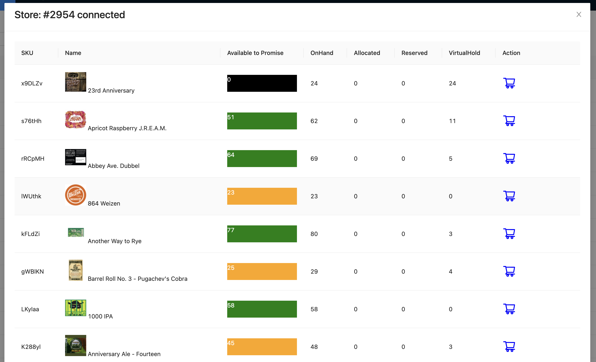

Build demo Inventodis inspire from https://www.youtube.com/watch?v=kXaSwsneFnY&t=21s

## Teck Stack

- [Riot file cli](https://developer.redis.com/riot/riot-file/index.html)
- [RedisSearch](https://redis.io/docs/stack/search/)
- [Redis-om-node](https://github.com/redis/redis-om-node)
- Expressjs
- Socket.io
- Nextjs

## Architecture


## Setup

### Client

```sh
yarn
yarn dev
```

### API

Run docker RedisSeach

```sh
make redis
```

Init schema & import

```sh
./loader.sh
```

Generate inventory

```sh
make generate
```

Start server

```sh
yarn local
```

## Screenshots





## Learn from demo

- Using riot file clit to import data to Redis
- RedisSearch
- Redis-om-node
- Socket.io
- Tool [RedisInsight](https://redis.com/redis-enterprise/redis-insight/)
- ...

## Reference

- https://github.com/redis-developer/brewdis
